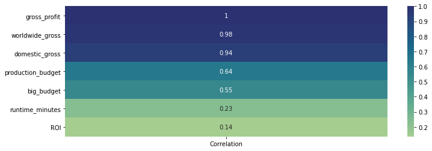
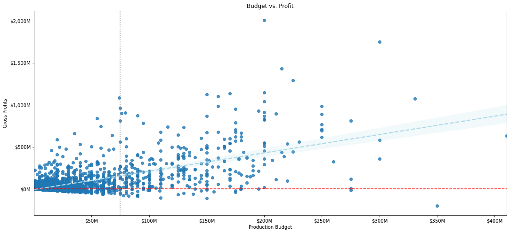
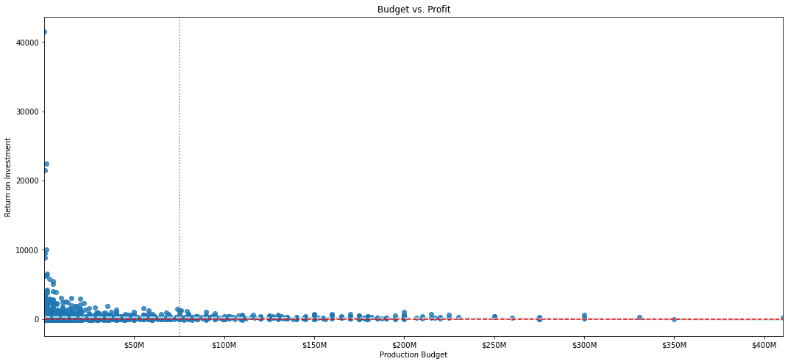
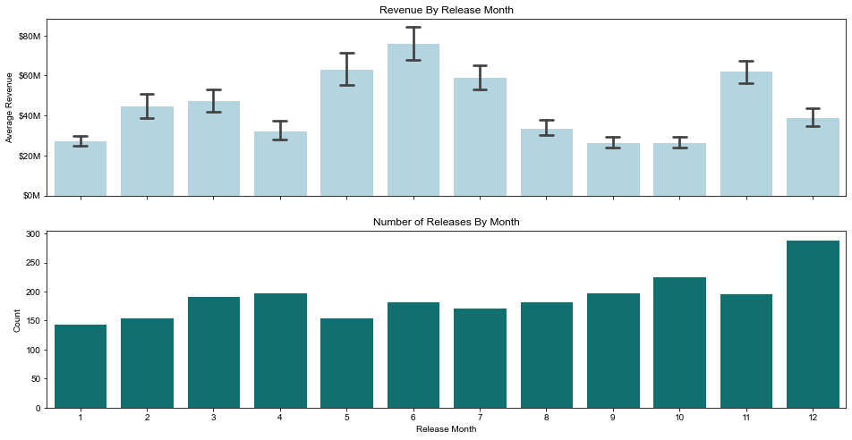
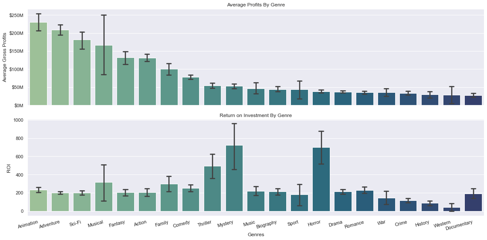
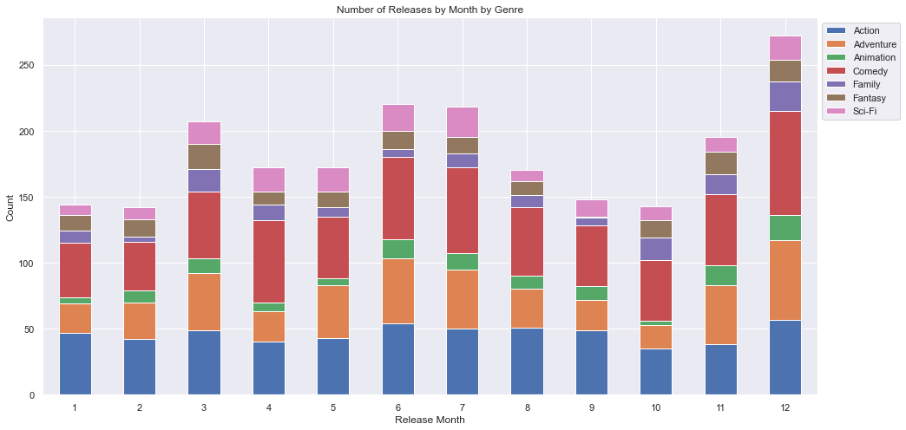
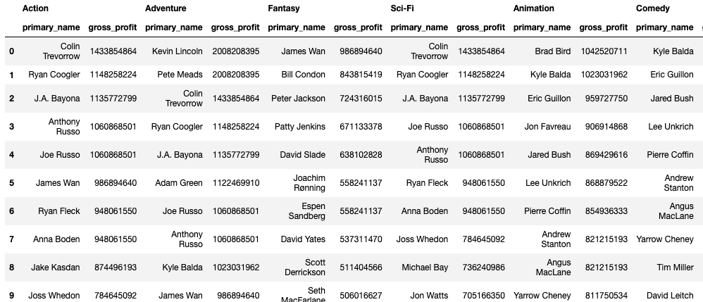

# Microsoft Studios 2022 Strategy Recommendations

**Authors**: Robert Cauvy

## Overview

This project leverages tools from base Python and pandas to provide exploratory data analysis that helps the head of Microsoft's fledgling movie studio decide what type of films to create. The actionable insights have been distilled from data sets provided by IMDB and The Numbers.

## Business Problem

After making the business decision to compete at the Box Office with original content. The new head of the studio must determine which projects should be prioritized for allocating resources. Since this is a brand new movie studio, decision making will rely on public and readily available historical data of past movie releases. Because optimal financial performance is the ultimate objective of this new business division, the analysis will use gross profits and rate of return as the primary metrics for benchmarking variables involving past films' genres, release dates and directors. Using these measurables to provide an unbiased, rational baseline for the studio head to begin with the early planning of the content and release strategy.  Once these key decisions have been approved, further analysis can be conducted. 

## Data Understanding

The data used in this project comes from sources, IMDB and The Numbers database. Specifically the data stored in the files; imdb.title.basics.csv, tn.movie_budgets.csv, imdb.title.crew.csv, imdb.name.basics.csv. After combining data from these sources, financial performance could be pulled from each individual title and used to measure variables surrounding the genre, release and director.

## Data Preparation

Now that we has selected the data tables that contain the information we need for our analysis, it must be prepared in a way that help answer questions stemming from the business problem. First, the IMDB Title Basics which contains information about individual films, such as titles and genres is merged with The Numbers Budgets data tables, at the at the movie title column to bring in release dates, production budgets and gross revenues form the box office. After removing duplicates, new columns are added to benchmark financial performances of each title. The two metrics used for this analysis are gross profits and return on investment. Before creating new columns to the dataframe, the financial data must be converted into integers  so that operations can be applied. The gross profit column was created by subtracting the worldwide gross revenues from the production budget and ROI is a ratio obtained by dividing worldwide gross profits by production budget and multiplying by 100.  

Since it can be assumed that the new studio head will be judged by how profitable his business division becomes gross profits will be the more important metric. And ROI be strategically used to optimize the studios resources and corporate overhead such as sound stages, utilities and human capital. Next, the release date column will be seperated into new columms also from strings to integers. This allows to filter out much older titles and suggest when releases should be scheduled.  Later in the analysis, we'll breakout each titles genre from a single string, seperated by commas into new row. SO that we can apply the financial metrics to genre categories. And lastly, the dataframe will be merged with IMDB's Film Crew and Basic Names data tables to identify and recomment which directors should be hired to work on films that fall into the priority genres. 

## Results

Q. What attributes are the most correlated with gross profit?

### Visual 1


Q. What does the relationship between production budget and profit look like?

### Visual 2


ROI?

### Visual 3



Q. Are Profits Impacted By Release Month?

### Visual 4



Q. What genres should be prioritized?

### Visual 5


Should certain genres be released at different times of the year?

### Visual 6


Q. Who are the key film crew members behind the top box office hits?

### Visual 7



## Conclusions

After understanding the business problem, the data required to answer those questions was selected and prepared for analysis. This was done by merging tables, dropping duplicated entries, altering object types and creating new columns.

After performing analysis the first recommendation for the business stakeholders are to plan releases for May-July and November. The second recommendation is to prioritize Animation, Comedy, and Family genres. And then plan big budget Adventure, Sci-Fi, Fantasy and Action projects and lastly supplement with small budget Mystery, Horror, Thriller and Romance that have potential to return great value. The third recommendation is to bring in proven filmmakers that have had success with projects in our targeted genres.

Of course this project is an exploratory data analysis and a much deeper review is required. There are a handful of outliers in the dataset that significantly skews the outcomes. It would be advisable to take a detailed look as to what separated those titles. Other important limitations of this analysis are Motion Picture Association ratings and actors. And perhaps the greatest limitation is the lack of marketing data. Since we discovered the strongest correlated attribute to gross profit is worldwide gross revenue. So looking into what promotes the greatest sales is certainly a worthwhile endeavor.
***

## For More Information

Please review our full analysis in [our Jupyter Notebook](./student.ipynb) or our [presentation](./Phase_1_Project_Presentation.pdf).

For any additional questions, please contact **Robert Cauvy & rcauvy@gmail.com**

## Repository Structure

Describe the structure of your repository and its contents, for example:

```
├── README.md                           <- The top-level README for reviewers of this project
├── student.ipynb   <- Narrative documentation of analysis in Jupyter notebook
├── Phase_1_Project_Presentation.pdf         <- PDF version of project presentation
├── data                                <- Both sourced externally and generated from code
└── images                              <- Both sourced externally and generated from code
```
